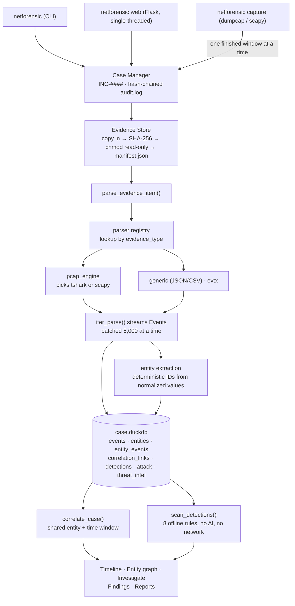

<div align="center">

# NetForensicAI

**Turn packet captures and endpoint logs into one correlated, evidence-cited investigation — entirely on your own machine.**

[](https://github.com/Sh3n0bi/NetForensicAI/actions/workflows/tests.yml)
[](https://www.python.org/downloads/)
[](LICENSE)
[](#wireshark-integration)

[Use cases](#use-cases) · [Install](#installation) · [How it works](#how-it-works) · [Worked example](#a-worked-investigation) · [Commands](#command-reference) · [Limitations](#limitations)

</div>

---

## Contents

- [Overview](#overview) · [Use cases](#use-cases) · [Why it exists](#why-it-exists) · [Design principles](#design-principles)
- [Installation](#installation) · [Quick start](#quick-start)
- [How it works](#how-it-works) · [A worked investigation](#a-worked-investigation)
- [Capabilities](#capabilities) · [Wireshark integration](#wireshark-integration)
- [Command reference](#command-reference) · [HTTP API](#http-api) · [Configuration](#configuration)
- [Architecture](#architecture) · [AI safety model](#ai-safety-model) · [Performance](#performance)
- [Limitations](#limitations) · [Testing](#testing) · [Contributing](#contributing) · [Security](#security-policy) · [License](#license)

---

## Overview

NetForensicAI takes raw digital evidence — packet captures, JSON/CSV logs, Windows Event Logs including Sysmon — and turns it into a single correlated investigation: normalized events, extracted entities, a unified timeline, an entity relationship graph, deterministic detections, and investigator-owned findings you can export as a report.

It runs entirely on your machine. **No cloud backend, no daemon, no database server, and no step that touches the network unless you explicitly opt into one.** A case is one DuckDB file plus a directory of JSON manifests and read-only evidence copies.

| | |
|---|---|
| **Input** | `.pcap` / `.pcapng` · `.json` · `.csv` · `.evtx` · live network capture |
| **Output** | Timeline · entity graph · detections · ATT&CK mapping · findings · Markdown / JSON / HTML reports |
| **Interfaces** | CLI (`netforensic`) and a local web UI — both over the same core |
| **Requires** | Python 3.9+. Wireshark optional but recommended. |

---

## Use cases

**Triage a suspicious capture from an alert.** Point it at the pcap, run one command, and read the timeline. Protocol-level events — DNS lookups, HTTP requests and their status codes, TLS SNI, recovered file transfers — come out already normalized, so you start at "what happened" rather than at packet 1.

```bash
netforensic evidence add ./alert-2026-08-28.pcap --case INC-0001 && netforensic analyze --case INC-0001
```

**Tie network activity to what happened on the host.** Add a pcap *and* a Sysmon EVTX export to the same case. Because entity IDs are derived deterministically from normalized values, the same IP or hostname in both sources resolves to the same ID and joins automatically — which is the whole reason the two are worth having in one case.

**Investigate one indicator across everything you hold.** Given an IP, domain, hash, user, host, process, or file, get its first/last seen, a scoped timeline, ranked related entities, a one-hop relationship graph, and deterministic next-step leads.

```bash
netforensic investigate --case INC-0001 --domain suspicious.example.com
```

**Run lightweight live monitoring on a segment.** Rotating capture auto-ingests each finished window through the same pipeline, detection rules included — so a match surfaces as an alert without any separate "watch" mode.

**Analyse a web attack from server-side capture.** Aggregate rules are built for this: they summarize a 41,000-request scan into a handful of findings rather than 41,000 rows, and separately surface *the paths that actually returned success* — what the scan found, not just that it happened.

**Produce a defensible report.** Every claim cites the `evidence_id` and `event_id` it rests on. Evidence is hashed on ingest and never modified; every action is recorded in a hash-chained custody log you can verify. Export the whole case to a zip with a per-file manifest and hand it to someone else.

> **Not a NIDS, not a SIEM.** There is no rule marketplace, no alert queue, no multi-user server, no retention tier. It is an investigator's workbench for evidence you already have.

---

## Why it exists

Real investigations span evidence formats that share no schema, no identifiers, and no notion of which events relate to which. Answering *"is the IP in this pcap the same host as the one in that log line?"* by hand is slow and error-prone, and the reasoning usually lives in someone's head rather than in the case.

NetForensicAI does that stitching mechanically and keeps every resulting claim traceable to the specific evidence file and event it came from.

### Design principles

| Principle | What it means in practice |
|---|---|
| **Deterministic first** | Parsing, correlation, timeline, and detections involve no AI and no network. Identical input produces identical output. |
| **Everything cites evidence** | No claim appears without the `evidence_id` / `event_id` it rests on. |
| **Never overstate certainty** | Correlation says `related` or `possible_relationship`, never "caused". Detections are flags, not verdicts. |
| **The investigator decides** | Nothing auto-creates a finding. AI proposes; a human confirms. |
| **Local-first, no infrastructure** | One DuckDB file plus a directory per case. No queue, no graph DB, no daemon. |
| **Honest about limits** | Known weaknesses are documented [here](#limitations) and in code, not hidden. |

---

## Installation

**From source**

```bash
git clone https://github.com/Sh3n0bi/NetForensicAI.git
cd NetForensicAI
python3 -m venv .venv
source .venv/bin/activate          # Windows: .venv\Scripts\activate
pip install -e ".[pcap,intel,web]"
```

**From PyPI** *(once a release is published — see [CONTRIBUTING.md](CONTRIBUTING.md))*

```bash
pip install "netforensicai[pcap,intel,web]"
```

### Python extras

Everything beyond case management and the CLI core is optional.

| Extra | Pulls in | Needed for |
|---|---|---|
| `pcap` | scapy, pandas, scikit-learn | pcap/pcapng parsing, live capture, anomaly scoring |
| `evtx` | python-evtx | Windows Event Log / Sysmon parsing |
| `intel` | requests | VirusTotal lookups |
| `ai` | anthropic, requests | AI assistant — Anthropic and Ollama providers |
| `ai-openai` | openai | AI assistant — OpenAI provider |
| `ai-gemini` | google-genai | AI assistant — Google Gemini provider |
| `web` | flask | Local web UI |
| `dashboard` | dash, plotly | Legacy `netforensic scan` visualization |
| `dev` | pytest | Test suite |
| `build` | build, twine | Packaging a release (maintainers) |

Only `intel`, `ai`, `ai-openai`, and `ai-gemini` can reach the network, and only when you explicitly invoke the feature that uses them. Ollama's traffic stays on your machine.

### Wireshark (optional, external)

Wireshark is **not** a pip extra — it is a separate program, and NetForensicAI uses three binaries from it. All are optional; install none and the pure-Python path handles everything.

| Binary | Used for | Without it |
|---|---|---|
| **`tshark`** | Dissection, display filters, slices, object export | Falls back to the built-in scapy engine |
| **`dumpcap`** | Live capture | Falls back to the scapy sniffer |
| **`Wireshark`** *(GUI)* | The `wireshark open` pivot only | `--print` still gives you the command to run elsewhere |

**`tshark` is the one that matters.** It carries the whole analysis path, so a server, container, or CI runner only needs that — no GUI, no Qt, no desktop stack:

```bash
sudo apt install tshark          # Debian / Ubuntu
sudo dnf install wireshark-cli   # Fedora / RHEL
brew install wireshark           # macOS (CLI tools; add --cask for the GUI)
```

On a Windows analyst workstation the [standard Wireshark installer](https://www.wireshark.org/download.html) provides all three. It does not add itself to `PATH`, which is fine — NetForensicAI checks `C:\Program Files\Wireshark` directly.

```bash
netforensic wireshark status
```

```
Wireshark: 4.6.8
  tshark:  C:\Program Files\Wireshark\tshark.exe
  dumpcap: C:\Program Files\Wireshark\dumpcap.exe
  GUI:     C:\Program Files\Wireshark\wireshark.exe
Parse engine:   tshark (requested: auto)
Capture engine: dumpcap
```

See [Wireshark integration](#wireshark-integration) for what each one changes.

---

## Quick start

### Command line

```bash
netforensic case create --name "Test Incident"
netforensic evidence add ./capture.pcap --case INC-0001
netforensic analyze --case INC-0001
netforensic detections list --case INC-0001
netforensic investigate --case INC-0001 --ip 192.168.1.10
netforensic report generate --case INC-0001 --format html
```

### Browser

```bash
netforensic web --cases-dir cases      # then open http://127.0.0.1:8000
```

1. **Settings** *(top right)* — optionally add VirusTotal / AI keys and press **Test**. Everything except threat intel and the AI assistant works with no keys at all.
2. **Cases** — create or open a case, then **Evidence → Choose File → Upload Evidence**.
3. **Run Analyze** — parses, correlates, and runs detection rules in one step.
4. Review **Timeline**, **Entities**, **Detections**, **ATT&CK**, **Custody**; record **Findings**; export a **Report**.

---

## How it works

### Starting up

There is no server and nothing runs in the background. `pip install` creates one console script, and every command is a process that starts, works against files on disk, and exits:

```
netforensic  →  netforensicai.cli:main  →  typer app()
```

Every heavy import lives **inside** the command function rather than at module top, so `netforensic --help` never pays for scapy, DuckDB, or Flask. All state lives in the case directory — there is nothing else to configure, start, or keep running.

### The pipeline

Every ingest path funnels through one function, `core/pipeline.py::parse_evidence_item`. The CLI, the web upload endpoint, and each live-capture rotation all call it, so there is no second, looser path into a case:



Three properties of that pipeline carry most of the design:

- **It streams.** `iter_parse` is a generator and the pipeline pulls 5,000 events at a time. A fully-dissected packet measures roughly **18× the file size in RAM**, so a 1 GB capture would need ~18 GB if loaded up front. Peak memory tracks working set, not capture size.
- **It is all-or-nothing.** Any exception deletes the partially-written events and returns an error. A half-ingested evidence item is worse than none, because correlation, detections, the timeline and the report would all silently reason over half a file with no indication anything was missing.
- **Entity IDs are the join key.** They derive deterministically from entity type + normalized value, so the same real-world entity resolves to the same ID across every evidence source. **That is the mechanism that makes cross-source correlation work** — the "graph" is a SQL join over `entity_events`.

### Where evidence lives

```
cases/INC-0001/
├── case.json            Case metadata and indexes
├── audit.log            Chain of custody (JSONL, hash-chained)
├── case.duckdb          Events, entities, correlation, detections, ATT&CK, TI
├── evidence/EV-0001/
│   ├── manifest.json    SHA-256, size, provenance
│   └── original/        Read-only copy of the source file
├── artifacts/EV-0001/   Files carved out of evidence
├── slices/              Captures carved by a display filter
├── findings/            Investigator-owned findings
└── reports/             Generated reports
```

`evidence add` copies the file in, hashes **the stored copy** rather than the source, marks it read-only, and writes a manifest. The original is only ever opened for reading. Everything downstream reasons over the copy, so what you analyzed is exactly what was preserved.

### Concurrency

DuckDB is single-writer, and this is a local single-user tool. The web UI runs **single-threaded on purpose**, and writes from the web layer and live-capture threads go through `locked_store()`, which serializes on a process-wide lock. There is no connection pool to size and no race to reason about.

---

## A worked investigation

One capture, start to finish. Output below is real, from a small capture containing an HTTP download and a TLS handshake.

**1. Open a case and register the evidence.** The file is copied, hashed, and never modified again:

```bash
netforensic case create --name "Suspicious outbound activity" --investigator analyst
netforensic evidence add ./capture.pcap --case INC-0001
```

```
Ingested EV-0001: capture.pcap
  Type:      pcap
  SHA256:    555291419e0fc99d9c080adb4ca0d86c2fc55e78ff653ced3f066e3a421c93f6
```

**2. Analyze** — parse, extract entities, correlate, and run detection rules in one step:

```bash
netforensic analyze --case INC-0001
```

```
  EV-0001 (pcap): 8 events, 15 entities
Analysis complete for INC-0001: 8 events, 15 distinct entities
Correlation: 21 related, 0 possible_relationship (time-proximity only)
Detections: none.
```

**3. Read the timeline.** One chronological view, filterable by entity, type, or evidence item:

```bash
netforensic timeline show --case INC-0001
```

```
2023-11-14T22:13:20.300000+00:00  http_request     EV-0001  HTTP GET http://evil.example.com/malware.exe (User-Agent: curl/8.0)
2023-11-14T22:13:20.400000+00:00  http_response    EV-0001  HTTP 200 OK for http://evil.example.com/malware.exe
2023-11-14T22:13:20.500000+00:00  tls_handshake    EV-0001  TLS ClientHello for c2.badguy.net
unknown                           file_transfer    EV-0001  Recovered 45-byte file 'malware.exe' from HTTP traffic via Wireshark object export
```

The download was **recovered as a real file**, not guessed at from magic bytes — that is tshark's object export. It is written to the case's `artifacts/` directory and hashed.

**4. Pivot on an entity** to see everything the case knows about it:

```bash
netforensic investigate --case INC-0001 --domain evil.example.com
```

```
Entity: domain 'evil.example.com' (ENT-domain-2dbe0e7fa5fb)
  Events:     1
Related Entities:
  ip_address        93.184.216.34                       (1 shared events)
  url               http://evil.example.com/malware.exe (1 shared events)
```

**5. Narrow the evidence.** A display filter carves a new, hashed capture recorded against its parent and the exact filter that produced it:

```bash
netforensic wireshark slice --case INC-0001 --evidence EV-0001 --display-filter 'http'
```

```
Wrote 2 packet(s) to cases/INC-0001/slices/EV-0001-slice.pcap
Added as EV-0002 - parse it with:
  netforensic parse --case INC-0001 --evidence EV-0002
```

**6. Look at the actual packets** behind any event, pre-filtered to that event's own frames:

```bash
netforensic wireshark open --case INC-0001 --event EVT-EV-0001-000001
```

**7. Record a finding and export.** Nothing above created a finding — that stays an explicit human act:

```bash
netforensic finding create --case INC-0001 --title "Executable retrieved from evil.example.com" \
    --severity High --event EVT-EV-0001-000001
netforensic report generate --case INC-0001 --format html
netforensic case audit --case INC-0001 --verify     # chain of custody intact?
```

---

## Capabilities

### Case management
`INC-####` IDs, one directory per case, a status lifecycle (`open` / `investigating` / `closed`, settable from the CLI or the dashboard), indexes over evidence, findings and artifacts, and irreversible deletion behind a typed confirmation.

### Evidence integrity
Every item is copied in, SHA-256 hashed from the stored copy, set read-only, and recorded in a manifest with its original path and modification time.

### Chain of custody
Every action — case created, evidence added, evidence parsed, analysis run, finding created or updated, report generated, capture started or stopped, threat intel checked, AI hypothesis requested, evidence sliced — is appended to a **hash-chained** `audit.log`. `case audit --verify` reports whether the record has been altered since it was written.

> This detects accidental corruption and casual after-the-fact editing. It does **not** stop an attacker who controls the machine, who could recompute the whole chain.

### Evidence parsers
All parsers normalize into one **Common Event Model**: `event_id`, `evidence_id`, `source`, `event_type`, `timestamp`, plus optional user/host/device, network (src/dst IP + port, protocol), process (name, PID, parent, command line), file (name, path, hash), domain/URL, severity/message, and `raw_event_reference` pointing back to the exact original record.

| Format | Notes |
|---|---|
| `.pcap` / `.pcapng` | Two interchangeable engines — **tshark** when Wireshark is installed, **scapy** (pure Python, no external binary) otherwise. Single streaming pass either way. |
| `.json` | Array, `{"events": [...]}`-wrapped, or single object. Case/separator-insensitive field aliasing (`src_ip` / `SourceIP` / `source_ip` all match). |
| `.csv` | Same aliasing, one event per row. |
| `.evtx` | Sysmon (ProcessCreate, NetworkConnection, ProcessTerminate, FileCreate, DNSQuery) gets rich field mapping; every other provider gets universal System fields plus full raw EventData. Pure Python, so Windows logs can be analyzed from any OS. |

Adding a fifth format means one `BaseParser` subclass — entity extraction, correlation, timeline, detections, and reporting need no changes.

### Network protocol analysis

The pcap parser has two engines. Neither is a superset of the other, so neither is hardcoded — `auto` picks tshark when Wireshark is installed and scapy when it is not, and `--engine` pins either one.

**scapy engine** — pure Python, works from a plain `pip install`, and produces **eight event types**, over both **IPv4 and IPv6**:

| Event type | What it captures |
|---|---|
| `network_connection` | One per distinct flow — TCP, UDP **and ICMP** — with packet and byte counts. Includes flows with no payload at all (handshakes, ACKs), which are most of real traffic. |
| `dns_query` | Queried name → `domain`. Detected **by payload, not port**, so DNS tunnelling off port 53 is caught. |
| `dns_response` | What the name actually resolved to — the mapping that links a domain in one evidence item to an IP in another. |
| `http_request` | Host → `domain`, full URL → `url`, User-Agent retained. Matched on the request line, so it works on **any** port. |
| `http_response` | Status code, paired back to the URL it answered — what separates a failed scan from a successful one. |
| `tls_handshake` | SNI hostname → `domain`, usually the only identifying detail recoverable from encrypted traffic. |
| `file_transfer` | Files carved from TCP streams by magic bytes (PDF, PNG, JPG, ZIP, EXE, GIF), optionally written to `artifacts/`. |
| `anomaly` | IsolationForest outliers over size / inter-arrival / ports. Small captures only — see [Limitations](#limitations). |

Also handled: VLAN (802.1Q) tags, IP fragments, pcapng containers, truncated captures *(keeps what was read)*, and malformed payloads *(never aborts the parse)*.

**tshark engine** — Wireshark's ~3000 dissectors instead of eight hand-written analyses. Same Common Event Model, same streaming, and it adds what the scapy engine structurally cannot see:

| Event type | What the tshark engine adds |
|---|---|
| `authentication` | **Kerberos and NTLM attempts** — principal, realm, workstation. Lateral movement *is* authentication traffic; to the scapy engine a Kerberoasting run is an unremarkable TCP flow to port 88. |
| `file_access` | SMB file opens, reads and writes, naming the share path touched. |
| `file_transfer` | **Real object export** (HTTP, SMB, FTP-DATA, TFTP, IMF) — the dissector knows where each object begins and ends, rather than inferring it from magic bytes. |
| `network_connection` | Wireshark's own protocol stack per flow (`eth:ethertype:ip:tcp:tls:http2`), so an unfamiliar flow is identifiable without reopening the capture. |

Everything else — DNS, HTTP request/response pairing, TLS SNI, flow aggregation, anomaly scoring — is produced by both engines, **under the same event-type names**, so a timeline filter or a detection rule behaves identically whichever engine ran. Every event also records which engine produced it in `raw_event_reference.engine`, because *"which dissector found this"* is a question a report has to answer months later.

### Content search
Parsing normalizes packets into events and **deliberately keeps no payload** — storing the bytes of every packet would defeat the streaming design. So *"where does this token appear"* has to go back to the capture file, which is what `netforensic search` does, via tshark. Text, regex, or hex:

```bash
netforensic search --case INC-0001 'flag{'
netforensic search --case INC-0001 'flag\{[^}]+\}' --mode regex
netforensic search --case INC-0001 '4d5a9000' --mode hex          # MZ header
netforensic search --case INC-0001 'password' --display-filter 'http'
```

**Measured on a 1,000,000-packet / 132 MB capture: about six seconds.** Every hit reports a frame number *and* a stream index, so a result leads straight to the packets — `wireshark open` takes the frame, `stream follow` takes the stream.

Case-insensitive search compiles to `matches` over an escaped literal rather than to `contains`, because `contains` is a case-sensitive byte match. The alternative — lowercasing the evidence — is not something a forensics tool should do to the bytes it reports on.

### Stream reassembly
A credential or a flag rarely lives in one packet; it lives in a conversation the network split across dozens of them.

```bash
netforensic stream list   --case INC-0001          # ranked by volume
netforensic stream follow --case INC-0001 42
```

Reassembly is delegated to Wireshark rather than reimplemented: retransmissions, overlap and reordering are genuinely hard, and a hand-rolled version would be a subtly wrong copy of something you can check against the GUI.

### Triage presets
The first questions worth asking an unfamiliar capture, in one command — protocol hierarchy (flagging every protocol that carries credentials in the clear), candidate flags, credentials and secrets, recoverable files with hashes, and the largest conversations.

```bash
netforensic ctf triage --case INC-0001
netforensic ctf hunt   --case INC-0001 --category secrets
netforensic ctf patterns
```

Named for the case it serves best — a CTF network challenge — but the questions are the ones that open a real intrusion investigation too.

Two rules it keeps. It **never writes to the case**: nothing here creates a finding, and object export is reported rather than saved unless you pass `--extract-to`. And it reports **candidates, not verdicts** — a regex matching something password-shaped has found a string, so every result names the pattern that matched and the frame it came from, and the judging happens against the packets.

### Entity extraction & correlation
Eleven entity types — `user`, `hostname`, `device`, `ip_address`, `domain`, `url`, `file`, `hash`, `process`, `port`, `network_connection` — each linked to the events it appears in.

Two modelling rules matter more than the list:

- **A source port is not an entity.** It is ephemeral — the OS picks it per socket — so it identifies a connection, never a thing an investigation is about. `dst_port` *is* indexed, because that identifies a service and *"show me everything touching port 4444"* is a real question. Both remain fields on the event, so timeline filters and search are unaffected.
- **`network_connection` is keyed on the host pair**, not the full flow tuple. With ports in the key it was unique per flow, so it could never be *shared* between two events — an entity that by construction correlated with nothing, at one row per event.

Correlation links events within a time window and is explicit about strength:

- **`related`** — shares an entity *and* is time-proximate
- **`possible_relationship`** — time-proximate only

Neither implies causality, and the reports say so.

Three rules keep the link budget spent on signal:

- **A shared port is not a relationship.** On an HTTP capture *"both events touched port 80"* is true of nearly every pair. Measured before this rule on a 3,000-packet capture: 38,782 of 50,000 links were shared-port links, 29,333 of them port 80 alone, against **33** keyed on a shared domain. Ports are indexed; they are not correlated on.
- **No single entity may take more than a tenth of the budget.** Correlation is pairwise, so a high-degree entity produces links *quadratically* — with ports removed, one address took 49,536 of 50,000 links and left 100 for every domain combined.
- **`related` is never displaced by `possible_relationship`.** The weak tier only ever uses budget the strong tier left.

**The link count is a ceiling, not a total.** A number landing exactly on the budget means correlation stopped, and both the CLI and the API say so rather than printing the round number as though it were a finding. On a dense capture, shorten `--time-window`.

### Timeline
One chronological view across all evidence, filterable by time range, user, IP, hostname, process, file, event type, or evidence source.

### Detection rules
Local, deterministic, zero-cost pattern matches. **No AI, no network call.** They run automatically on every `analyze` — unlike ATT&CK mapping, which is opt-in.

**Per-event rules**

| Rule | Fires on |
|---|---|
| `OFFENSIVE-TOOL-NAME` | Process names of credential-access / lateral-movement tooling |
| `SUSPICIOUS-PORT` | Ports historically associated with C2 frameworks |
| `DOUBLE-EXTENSION-FILE` | Executables disguised as documents (`invoice.pdf.exe`) |
| `CREDENTIAL-ARTIFACT` | SAM hive, `ntds.dit`, lsass dumps |

**Aggregate rules** — these summarize across many events, because emitting one detection per packet would bury a 41,000-request scan under 41,000 identical rows.

| Rule | Fires on |
|---|---|
| `ATTACK-TOOL-USER-AGENT` | Scanner / exploitation tooling by User-Agent (gobuster, sqlmap, nikto, ffuf, nmap, hydra…) |
| `HTTP-PATH-ENUMERATION` | One source requesting many distinct paths from one host |
| `SQL-INJECTION-ATTEMPT` | Injection payloads, **URL-decoded** first. Rated *high* only when the server actually returned success — intent and impact are different findings. |
| `SCAN-SUCCESSFUL-PATHS` | The paths that returned success amid a 404-heavy scan — *what the scan actually found* |

### MITRE ATT&CK mapping
Deterministic, rule-based, evidence-cited suggestions — never an automated "this happened" claim. Currently T1059, T1059.001, T1027, T1105. Each carries an investigator-settable status (`potential` / `confirmed` / `rejected`) that survives re-scans.

### Investigation
`netforensic investigate <entity>` returns everything the case knows about one IP, user, hash, host, domain, process, file, or device: related evidence, a scoped timeline, ranked related entities, a 1-hop relationship graph, and deterministic leads — plus optional threat-intel and AI enrichment.

### Threat intelligence
Optional, explicit, cached VirusTotal lookups for IPs and file hashes. Never automatic, never sent evidence content, cached in the case so repeat runs don't re-query. Values are validated as a real IP or MD5/SHA-1/SHA-256 before anything is sent.

### AI assistant
Optional, never on the critical path. Four interchangeable providers — **Anthropic, OpenAI, Ollama (fully local), Google Gemini** — selected per request. See [AI safety model](#ai-safety-model).

Two shapes, one contract. `investigate --ai` hands a fixed set of events to the model and gets back one hedged hypothesis. `chat` lets the model **retrieve** instead:

```bash
netforensic chat --case INC-0001 "was anything downloaded from an external host?"
netforensic chat --case INC-0001                    # interactive
```

It cannot see the evidence. It reaches it through eight read-only tools — content search, stream following, stream listing, event search, detections, entities, protocol summary, evidence listing — and **every tool call appends what it returned to a citation ledger.** The answer must cite from that ledger and nothing else.

Membership is an exact test on the `(kind, evidence_id, reference)` triple, not a substring search of the transcript: a looser check would accept the model quoting an identifier back out of *its own earlier reasoning*, which is the failure being guarded against. An unverifiable citation gets one correction pass naming exactly what failed; if it comes back unverifiable again the **whole answer is refused**, not shown with a caveat.

The loop is JSON the model returns rather than four native tool-calling integrations. Each provider expresses tool use differently, so native support would put the safety-critical path in four places and leave **Ollama** — the only provider that keeps an investigation entirely off the network — worst supported. The transport is not what makes this safe; the ledger is.

### Findings & reporting
Investigator-owned findings (`Open` / `Investigating` / `Confirmed` / `Rejected` / `False Positive` / `Resolved`), each citing specific evidence + event pairs, creatable from CLI or web UI. Reports render to **Markdown, JSON, and HTML**, every section traceable to evidence, with a stated limitations section.

### Web UI
A dependency-free frontend (no CDN, no build step — works offline) over the same core modules the CLI uses:

The rail groups destinations by the stage of an investigation rather than listing them flat:

| | |
|---|---|
| **Evidence** | Evidence · Live capture |
| **Dig** | Search · Streams · Triage |
| **Analysis** | Timeline · Entities · Detections · ATT&CK |
| **Conclude** | Findings · Reports · Chain of custody |
| **Assistant** | Ask (cited) |

The **Overview is a dashboard**: KPI tiles, an analysis runner reporting *in progress / complete / completed-with-errors* (per-evidence failures listed individually — a partially-failed analyze is not a success), an event-density chart, top entities, a one-hop entity graph, recent detections, carved files, triage matches, an ask box, and the custody trail with its verification state. Charts are inline SVG: no build step, no CDN, works offline.

Surfaces that need tshark are **dimmed and explained, never hidden** — a missing item reads as a missing feature, a disabled one reads as a setup step. The rail carries live capture status; the status bar reports which Wireshark tools were actually detected.

### Live capture
Rotating pcap capture that auto-ingests each finished window through the **exact same pipeline** as a manually added file — including detection rules, so a match surfaces as an alert within one poll. That makes it a lightweight live-alerting mode with no separate "watch" step.

| Backend | Notes |
|---|---|
| `dumpcap` | Wireshark's capture engine, preferred when installed. Does the packet copying and the rotation itself, in C, using its own ring buffer — so no packet is lost at a window boundary the way a Python-side rotation can lose one. It is also the one small program Wireshark isolates capture privileges into. |
| `scapy` | Pure-Python fallback. Every packet crosses into Python to be written, which is what limits it on a busy link. |

With dumpcap present, `--list-interfaces` also shows Wireshark's human-readable interface descriptions — which is what makes a Windows `\Device\NPF_{GUID}` identifiable as a particular NIC.

> Requires a packet-capture driver (Npcap / libpcap) and elevated privileges. This tool installs neither and grants neither.

### Case portability
Export a whole case to one zip archive with a SHA-256 manifest of every file. Import verifies **every** file against that manifest before writing anything, so a tampered or corrupted archive is rejected outright rather than partially extracted.

---

## Wireshark integration

Optional and auto-detected. Install Wireshark and NetForensicAI starts using it; don't, and every feature below simply isn't offered while the rest of the platform works unchanged. Nothing here installs, downloads, or elevates anything.

### tshark, not the GUI

The integration is built on **`tshark`** — Wireshark's command-line engine — plus **`dumpcap`** for capture. The desktop GUI is used for exactly one thing: opening a capture for you to look at, when you ask it to. Everything else runs headless.

That matters in practice: a server, container, or CI runner installs `tshark` alone and gets the entire analysis path. See [Installation](#wireshark-optional-external) for per-platform commands, and run `netforensic wireshark status` to see what was detected.

### What it adds

| | |
|---|---|
| **Dissection** | tshark's ~3000 protocol dissectors replace eight hand-written analyses — see [Network protocol analysis](#network-protocol-analysis). |
| **Live capture** | dumpcap replaces the scapy sniffer — see [Live capture](#live-capture). |
| **Display filters** | Wireshark's filter language, validated by tshark itself, both to narrow a parse and to carve evidentiary slices. |
| **GUI pivot** | Open the capture behind any finding in Wireshark, pre-filtered to the exact packets that finding was drawn from. |

### Display filters

Filters can narrow ingestion, which is how a focused subset of a very large capture gets analyzed without carving it first:

```bash
netforensic parse --case INC-0001 --evidence EV-0001 --display-filter 'ip.addr == 10.0.0.5 && tcp.port == 445'
```

Or carve a slice, which is the *evidentiary* form. The slice is a real capture file, so it goes back through the normal evidence path — hashed, recorded against its parent and the exact filter that produced it, and analyzable on its own. That is what makes "I filtered the capture down to this" reproducible by someone else later, which a screenshot of a filtered GUI is not:

```bash
netforensic wireshark slice --case INC-0001 --evidence EV-0001 --display-filter 'dns.qry.name contains "evil"'
```

A filter that matches nothing writes nothing: an empty capture in the chain of custody would imply something was found. Asking for a display filter while the scapy engine is in use is an **error**, not a silent no-op — being handed every packet while believing you filtered is the worst possible outcome.

### GUI pivot

```bash
netforensic wireshark open --case INC-0001 --event EVT-EV-0001-000042
```

The filter is derived from the event's own recorded frame numbers, so what opens is exactly the traffic behind the finding rather than something that merely resembles it. `--print` emits the command instead of launching, for use over SSH or in a report.

The web UI deliberately **does not** launch the GUI. It returns the filter and the command for you to run: a browser page must not be able to spawn a desktop application on the machine running the server, and "it's bound to localhost" is a deployment detail, not a guarantee.

### Discovery

PATH first, then the standard install directories (including `C:\Program Files\Wireshark`, which the Windows installer does not add to PATH). Override with `NETFORENSIC_WIRESHARK_DIR`, or point at individual binaries with `NETFORENSIC_TSHARK` / `NETFORENSIC_DUMPCAP` / `NETFORENSIC_WIRESHARK`.

Requesting a specific engine that isn't installed is an error rather than a silent fallback — an analyst who passed `--engine tshark` is asking for a reproducible dissection, and quietly substituting a different one would put results in a report that the command printed beside them cannot reproduce.

---

## Command reference

Every command supports `--help` and `--cases-dir` (env `NETFORENSIC_CASES_DIR`, default `cases`).

**Cases**
```bash
netforensic case create --name "Incident" [--description "..."] [--investigator "..."]
netforensic case list
netforensic case status --case INC-0001 open|investigating|closed
netforensic case audit  --case INC-0001 [--verify]
netforensic case export --case INC-0001 [--output INC-0001.zip]
netforensic case import ./INC-0001.zip [--cases-dir other_cases]
netforensic case delete --case INC-0001              # irreversible; see below
```

`case delete` removes the evidence copies, the event store, carved artifacts, findings, reports **and the chain of custody** — the audit log lives inside the case directory. There is no soft delete and no trash: a forensics tool that pretends to delete evidence while keeping a copy is worse than one that deletes it, because the copy is then unaccounted for. Both the CLI and the web UI make you **type the case ID** rather than click through a yes/no, and both report what was removed.

**Evidence**
```bash
netforensic evidence add ./file --case INC-0001     # .pcap/.pcapng/.json/.csv/.evtx
netforensic evidence list --case INC-0001
netforensic parse --case INC-0001 --evidence EV-0001 [--engine auto|tshark|scapy] [--display-filter '...']
```

**Analysis**
```bash
netforensic analyze --case INC-0001                 # parse + correlate + detect
netforensic analyze --case INC-0001 --engine tshark # pin the dissection engine
netforensic timeline build --case INC-0001
netforensic timeline show  --case INC-0001 [--user ...] [--ip ...] [--type ...] [--evidence EV-0001]
netforensic detections list --case INC-0001 [--severity high]
```

**Wireshark** *(only available when Wireshark is installed — see [Wireshark integration](#wireshark-integration))*
```bash
netforensic wireshark status                        # what was found, which engines are live
netforensic wireshark check-filter 'tls.handshake.extensions_server_name contains "c2"'
netforensic wireshark open  --case INC-0001 --event EVT-EV-0001-000042   # or --evidence EV-0001, + --print
netforensic wireshark slice --case INC-0001 --evidence EV-0001 --display-filter 'dns'
```

**Investigation**
```bash
netforensic investigate --case INC-0001 --ip 192.168.1.10
#   or --user / --hash / --host / --domain / --process / --file / --device
netforensic investigate --case INC-0001 --ip 1.2.3.4 --vt-api YOUR_KEY
netforensic investigate --case INC-0001 --ip 1.2.3.4 --ai --ai-provider ollama
netforensic investigate --case INC-0001 --ip 1.2.3.4 --ai --ai-provider gemini --model gemini-3.6-flash
```

**Findings**
```bash
netforensic finding create --case INC-0001 --title "..." --severity High --event EVT-...
netforensic finding list   --case INC-0001
netforensic finding update --case INC-0001 --finding F-0001 --status Confirmed --note "..."
```

**MITRE ATT&CK**
```bash
netforensic attack scan   --case INC-0001
netforensic attack list   --case INC-0001
netforensic attack update --case INC-0001 --technique T1059.001 --status confirmed
```

**Reports · Capture · Web**
```bash
netforensic report generate --case INC-0001 --format markdown|json|html [--output PATH]
netforensic capture --list-interfaces
netforensic capture --case INC-0001 --interface "\Device\NPF_{...}" --filter "tcp port 443" --rotate-seconds 30
netforensic capture --case INC-0001 --engine dumpcap|scapy   # default: auto
netforensic web --cases-dir cases [--host 127.0.0.1] [--port 8000]
netforensic scan ./capture.pcap [--vt-api KEY] [--save-files] [--no-dashboard]   # legacy standalone
```

---

## HTTP API

The web UI is a client of this API, not a second implementation — every route calls the same core modules the CLI does. It is served on `127.0.0.1` by default and has **no authentication**; see [Limitations](#limitations).

State-changing requests need an `X-Requested-With: NetForensicAI` header. That is not a session token — the app has no sessions — it is there so a cross-origin form or `fetch` from a malicious page cannot reach these routes blind.

| | |
|---|---|
| `GET /api/cases` · `GET /api/cases/<id>` | list, and one case with its counters |
| `POST /api/cases/<id>/status` | `open` / `investigating` / `closed` |
| `DELETE /api/cases/<id>` | irreversible; body must echo `{"confirm": "<id>"}` |
| `GET · POST /api/cases/<id>/evidence` | list and upload |
| `POST /api/cases/<id>/analyze` | parse, correlate, scan rules |
| `GET /api/cases/<id>/timeline` · `/entities` · `/detections` · `/attack` · `/findings` · `/audit` · `/artifacts` | the case, read back |
| `POST /api/cases/<id>/search` | content search over a capture |
| `GET /api/cases/<id>/streams` · `/streams/<n>` | list conversations, reassemble one |
| `GET /api/cases/<id>/triage` | protocols, candidates, files, conversations |
| `POST /api/cases/<id>/chat` | ask a question; refusals return 502 |
| `GET /api/wireshark/status` · `POST /api/wireshark/check-filter` | tooling and filter validation |
| `POST /api/cases/<id>/evidence/<eid>/slice` | carve a display-filter slice as new evidence |
| `GET /api/cases/<id>/capture/status` · `POST .../start` · `.../stop` | live capture |

`search`, `streams`, `triage` and `artifacts` are **read-only questions asked of a capture file**: none writes to the store, creates a finding, or records an audit entry — noting that somebody *looked* at evidence is not what a chain of custody is for. `triage` deliberately does not extract files, because a GET a dashboard polls must not write to disk.

The entities route takes `?sort=events&limit=N`, applied after sorting so `limit` means "the top N".

---

## Configuration

API keys can be saved once via the web UI's **Settings** page instead of passed per command.

Resolution order: **explicit flag → provider environment variable → saved config**.

| Setting | Environment variable |
|---|---|
| VirusTotal | `VT_API_KEY` |
| Anthropic | `ANTHROPIC_API_KEY` |
| OpenAI | `OPENAI_API_KEY` |
| Gemini | `GEMINI_API_KEY` |

Engine selection is a saved setting rather than a key, and follows **explicit flag → environment variable → saved config → `auto`**:

| Setting | Environment variable | Values |
|---|---|---|
| pcap dissection engine | `NETFORENSIC_PCAP_ENGINE` | `auto`, `tshark`, `scapy` |
| Live capture backend | `NETFORENSIC_CAPTURE_ENGINE` | `auto`, `dumpcap`, `scapy` |
| Wireshark install directory | `NETFORENSIC_WIRESHARK_DIR` | a path |

Saved keys live in `~/.netforensicai/config.json` (owner read/write where the OS enforces it) — deliberately **outside** the cases directory, so they can never be included in an exported case archive. The web API never returns a saved key to the browser; only whether it is set, and its last four characters.

---

## Architecture

**No message queue, no microservices, no graph database.** A case is one DuckDB file plus a directory of JSON manifests and evidence copies. The "graph" is a SQL join.

```
netforensicai/
├── core/
│   ├── case.py          Case lifecycle, INC-#### IDs, on-disk layout
│   ├── evidence.py      Ingest, SHA-256, read-only copies, provenance
│   ├── audit.py         Chain of custody (append-only, hash-chained)
│   ├── event.py         Common Event Model
│   ├── store.py         DuckDB access, bulk insert, streaming cursors
│   ├── pipeline.py      Shared evidence → events → entities ingestion
│   ├── entities.py      Entity extraction and deterministic IDs
│   ├── correlation.py   Sliding-window pairing, shared-entity links
│   ├── timeline.py      Chronological view and filters
│   ├── detections.py    Bundled offline rules (per-event + aggregate)
│   ├── attack.py        MITRE ATT&CK technique mapping
│   ├── investigate.py   Entity-scoped investigation and leads
│   ├── threat_intel.py  Opt-in enrichment with caching
│   ├── ai_assistant.py  Multi-provider AI with evidence contract
│   ├── finding.py       Investigator-owned findings
│   ├── report.py        Markdown / JSON / HTML rendering
│   ├── capture.py       Live capture with rotating windows (dumpcap · scapy)
│   ├── export.py        Portable case archives
│   └── config.py        API keys and preferences (outside cases/)
├── integrations/
│   └── wireshark.py     Tool discovery, display filters, slices, GUI pivot
├── parsers/             base · pcap_engine (dispatch) · pcap (scapy) ·
│                        pcap_tshark · generic (JSON/CSV) · evtx
├── web/                 Flask API + dependency-free frontend
└── cli.py               Typer command surface
```

---

## AI safety model

The AI assistant is the **last, optional** step in the pipeline — never a replacement for any step before it. Providers are interchangeable: Anthropic, OpenAI, a local Ollama server, or Google Gemini.

Every property below is enforced **in code**, identically regardless of which provider answered:

- It only ever sees already-normalized `Event` data for the entity you investigated — **never raw evidence file contents**, and nothing outside that scope.
- Its response is a fixed schema, not free text: `evidence_sufficient`, `claim` (phrased as a possibility), `observed_evidence` (fact, kept separate from interpretation), `confidence`, `alternative_explanation`, `recommended_validation`, `evidence` (the exact evidence/event pairs cited).
- **Every citation is checked against the events actually sent.** A hypothesis citing anything not in that set is rejected outright and never shown. This is code, not a prompt instruction.
- **It never writes a finding.** Turning a hypothesis into one is always an explicit investigator action.
- Every request and its outcome — including failures — is recorded in the chain of custody.

Verified against a live API, not only mocks: a real Gemini response returned citations that passed the contract check, with all safety properties intact.

Transient provider failures (overload, rate limiting) are retried with backoff. Credential errors and retired-model errors are **not** retried — they fail identically every time, so retrying only delays a clear message.

---

## Performance

Measured on a real 30 MB / 88,862-packet capture producing 84,712 events:

| Stage | Result |
|---|---|
| Full `analyze` | **~85 seconds** |
| Ingest peak memory | 166 MB |
| Correlation peak | 387 MB |
| Detections peak | 166 MB |

Parsing is a **single streaming pass** — scapy's fully-dissected packets measure ~18× file size in RAM, so a 1 GB capture would need ~18 GB if loaded up front. Events stream from parser to database in batches, and correlation and detections read back through a cursor, so peak memory tracks working set rather than capture size.

### Where the time actually goes

Profiled on a 100,000-packet capture producing 159,892 events. The answer was not where any of the obvious suspects pointed:

| phase | share |
|---|---|
| tshark + dissection | **6%** |
| DuckDB event inserts | 27% |
| **entity extraction + storage** | **66%** |

Dissection — the part that looks expensive — is a rounding error. Writing entity links is the cost.

The fix was the write path, not the parser: DuckDB reads a DataFrame columnar-natively instead of parsing a statement with thousands of placeholders and binding each value, which is **16,000 → 239,000 rows/s**. pandas stays optional; without it the chunked-`VALUES` path still runs, and the row counts where this matters come from pcap ingestion, which already installs it.

| | before | after |
|---|---|---|
| 100k packets / 13 MB | 148.8 s | **35.6 s** |
| throughput | 1,075 events/s | **4,497 events/s** |
| 1M packets / 132 MB | *did not finish in 25 min* | **832 s** (1.59M events) |

Three approaches that did **not** work, recorded so nobody re-tries them: `ON CONFLICT` costs only 1.4×; larger `VALUES` chunks are *slower*, not faster, because the SQL text grows faster than round trips shrink; and `executemany` with an `ON CONFLICT` clause **crashes the DuckDB Python client** with a fatal GIL error rather than raising.

Throughput still degrades with case size — 4,497/s at 100k against 1,907/s at 1M — because every entity-link insert probes a growing index. Entity storage remains the dominant cost at scale.

---

## Limitations

Stated plainly, because a forensics tool that hides its weaknesses is worse than one that has them.

- **The correlation link count is a ceiling, not a total.** It caps at 50,000 pairs, and on a dense capture it will reach that: tens of thousands of shared-host pairs inside a five-minute window genuinely exist. The budget is now spent on signal first — ports are not correlated on, no entity may take more than a tenth of it, and `related` is never displaced by `possible_relationship` — and both the CLI and the API say when the number is a ceiling. Shorten `--time-window` on a dense case; detections and the timeline are the better entry points either way.
- **Anomaly detection is disabled above ~20,000 packets.** IsolationForest's `contamination` is a *proportion*, so on a large capture it flags a fixed percentage of everything by construction — a quantile, not a finding. It stays on for smaller captures where an outlier means something.
- **HTTP request/response pairing is FIFO per flow.** Correct for ordinary keep-alive traffic; genuinely pipelined requests could mis-pair, so a response's URL is a reference rather than a certainty.
- **Correlation memory is reduced but not constant** — it still holds one entity-link map proportional to the case.
- **ATT&CK coverage is deliberately small** (four techniques). Each was chosen because the signal is specific, not to pad a matrix.
- **EVTX covers five Sysmon event types richly**, everything else generically.
- **The custody hash chain** detects corruption and casual editing, not an attacker who owns the machine.
- **Live capture needs Npcap/libpcap and elevated privileges**, which this tool does not install or grant.
- **Ingest is the scaling limit, not dissection.** tshark reads a 1M-packet capture in 46 seconds; putting those events and their entity links into the store takes about fourteen minutes, and throughput degrades with case size (4,497 events/s at 100k against 1,907/s at 1M) because every entity-link insert probes a growing index. For very large captures the workflow is to **search and slice first, then ingest the slice** — search and `wireshark slice` read the capture file and scale to gigabytes.
- **The assistant has not been exercised against a live provider in this repository's testing.** Its rendering, its tool loop and its refusal path are covered against a scripted model; the HTTP round trip to Anthropic, OpenAI, Gemini or Ollama is not.
- **Exported objects carry no timestamp.** tshark reports the recovered file but not the frame it completed on, so those `file_transfer` events sort at the end of a timeline as `unknown`. A wrong timestamp on forensic evidence is worse than an absent one, so none is invented.
- **The two pcap engines do not produce identical output.** That is the point — tshark sees protocols the scapy engine cannot — but it means a case re-analyzed under a different engine will not have identical events. Each event records the engine that produced it, and `--engine` pins one when reproducibility matters.
- **tshark object export runs as a second pass** over the capture. It keeps the streaming parse's memory profile intact, at the cost of reading the file twice when an output directory is given.
- **Exported objects carry no timestamp.** tshark's object export reports the recovered file but not the frame it completed on, so `file_transfer` events from it sort at the end of the timeline as `unknown` rather than in position. A wrong timestamp on forensic evidence is worse than an absent one, so none is invented — the parent flow's events carry the timing.
- **The web UI has no authentication.** It is a local single-user tool bound to `127.0.0.1` by default; binding it elsewhere exposes every case on the machine.

---

## Testing

```bash
pip install -e ".[dev,pcap,intel,evtx,ai,ai-openai,ai-gemini,web]"
pytest
```

**612 tests**, run in CI against Python 3.9 and 3.12, plus a dedicated job that installs tshark so the Wireshark integration is genuinely exercised rather than skipped, and a packaging check that installs the built wheel into a clean environment and confirms the web UI's assets are actually bundled.

The suite favours real fixtures over mocks: pcaps built with scapy, EVTX from hand-crafted XML matching the real schema, cases from `tmp_path`, and real tshark invocations wherever Wireshark is present. Mocks are reserved for what genuinely cannot be exercised in CI — external APIs, and opening a live network interface.

Several classes of bug were found only by running against real evidence and real tooling rather than synthetic fixtures — silently-dropped IPv6, HTTPS payloads skipped because scapy re-dissects them, DNS missed off port 53, a quadratic insert that made a 30 MB file take over 15 minutes, and a live-capture counter that reported the session total in the per-window field. Each is now pinned by a regression test.

---

## Contributing

See [CONTRIBUTING.md](CONTRIBUTING.md) for development setup, the parser plugin interface, and the release process.

The shape of a good contribution here: a new `BaseParser` subclass for a format, a detection rule with a specific and defensible signal, or a regression test for a bug found against real evidence.

## Security policy

This is defensive tooling for evidence you are authorized to analyze. It does not exploit, attack, or scan anything.

Nothing leaves your machine unless you explicitly invoke threat intel or a hosted AI provider. Live capture requires privileges the tool does not grant itself. If you find a security issue in NetForensicAI, please open an issue or contact the maintainer rather than disclosing it publicly first.

## License

[MIT](LICENSE).
