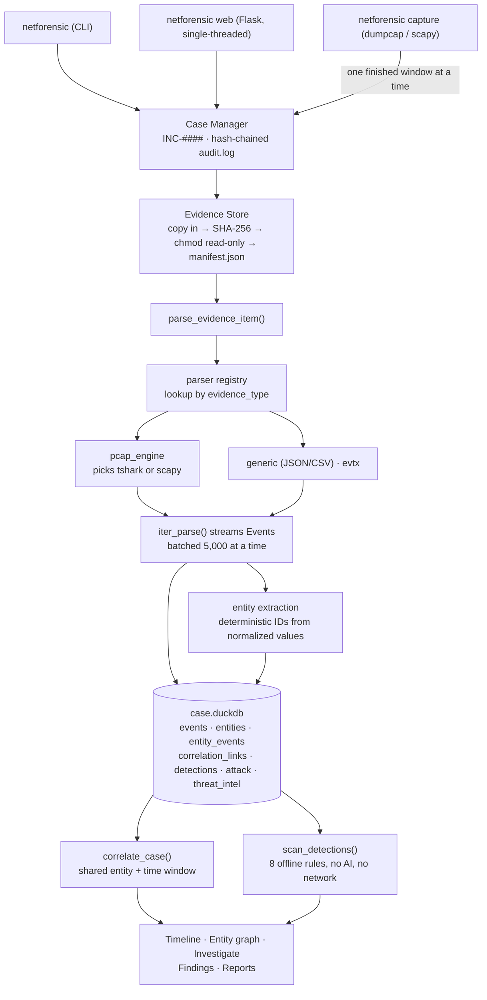

[← README](../README.md) · [Capabilities](capabilities.md) · [Commands](commands.md) · [HTTP API](api.md) · [Wireshark](wireshark.md) · [Architecture](architecture.md) · [Walkthrough](walkthrough.md)

---

# How it works

## Starting up

There is no server and nothing runs in the background. `pip install` creates one console script, and every command is a process that starts, works against files on disk, and exits:

```
netforensic  →  netforensicai.cli:main  →  typer app()
```

Every heavy import lives **inside** the command function rather than at module top, so `netforensic --help` never pays for scapy, DuckDB, or Flask. All state lives in the case directory — there is nothing else to configure, start, or keep running.

## The pipeline

Every ingest path funnels through one function, `core/pipeline.py::parse_evidence_item`. The CLI, the web upload endpoint, and each live-capture rotation all call it, so there is no second, looser path into a case:



Three properties of that pipeline carry most of the design:

- **It streams.** `iter_parse` is a generator and the pipeline pulls 5,000 events at a time. A fully-dissected packet measures roughly **18× the file size in RAM**, so a 1 GB capture would need ~18 GB if loaded up front. Peak memory tracks working set, not capture size.
- **It is all-or-nothing.** Any exception deletes the partially-written events and returns an error. A half-ingested evidence item is worse than none, because correlation, detections, the timeline and the report would all silently reason over half a file with no indication anything was missing.
- **Entity IDs are the join key.** They derive deterministically from entity type + normalized value, so the same real-world entity resolves to the same ID across every evidence source. **That is the mechanism that makes cross-source correlation work** — the "graph" is a SQL join over `entity_events`.

## Where evidence lives

```
cases/INC-0001/
├── case.json            Case metadata and indexes
├── audit.log            Chain of custody (JSONL, hash-chained)
├── case.duckdb          Events, entities, correlation, detections, ATT&CK, TI
├── evidence/EV-0001/
│   ├── manifest.json    SHA-256, size, provenance
│   └── original/        Read-only copy of the source file
├── artifacts/EV-0001/   Files carved out of evidence
├── slices/              Captures carved by a display filter
├── findings/            Investigator-owned findings
└── reports/             Generated reports
```

`evidence add` copies the file in, hashes **the stored copy** rather than the source, marks it read-only, and writes a manifest. The original is only ever opened for reading. Everything downstream reasons over the copy, so what you analyzed is exactly what was preserved.

## Concurrency

DuckDB is single-writer, and this is a local single-user tool. The web UI runs **single-threaded on purpose**, and writes from the web layer and live-capture threads go through `locked_store()`, which serializes on a process-wide lock. There is no connection pool to size and no race to reason about.

---

# Architecture

**No message queue, no microservices, no graph database.** A case is one DuckDB file plus a directory of JSON manifests and evidence copies. The "graph" is a SQL join.

```
netforensicai/
├── core/
│   ├── case.py          Case lifecycle, INC-#### IDs, on-disk layout
│   ├── evidence.py      Ingest, SHA-256, read-only copies, provenance
│   ├── audit.py         Chain of custody (append-only, hash-chained)
│   ├── event.py         Common Event Model
│   ├── store.py         DuckDB access, bulk insert, streaming cursors
│   ├── pipeline.py      Shared evidence → events → entities ingestion
│   ├── entities.py      Entity extraction and deterministic IDs
│   ├── correlation.py   Sliding-window pairing, shared-entity links
│   ├── timeline.py      Chronological view and filters
│   ├── detections.py    Bundled offline rules (per-event + aggregate)
│   ├── attack.py        MITRE ATT&CK technique mapping
│   ├── investigate.py   Entity-scoped investigation and leads
│   ├── threat_intel.py  Opt-in enrichment with caching
│   ├── ai_assistant.py  Multi-provider AI with evidence contract
│   ├── finding.py       Investigator-owned findings
│   ├── report.py        Markdown / JSON / HTML rendering
│   ├── capture.py       Live capture with rotating windows (dumpcap · scapy)
│   ├── export.py        Portable case archives
│   └── config.py        API keys and preferences (outside cases/)
├── integrations/
│   └── wireshark.py     Tool discovery, display filters, slices, GUI pivot
├── parsers/             base · pcap_engine (dispatch) · pcap (scapy) ·
│                        pcap_tshark · generic (JSON/CSV) · evtx
├── web/                 Flask API + dependency-free frontend
└── cli.py               Typer command surface
```

---

# Performance

Measured on a real 30 MB / 88,862-packet capture producing 84,712 events:

| Stage | Result |
|---|---|
| Full `analyze` | **~85 seconds** |
| Ingest peak memory | 166 MB |
| Correlation peak | 387 MB |
| Detections peak | 166 MB |

Parsing is a **single streaming pass** — scapy's fully-dissected packets measure ~18× file size in RAM, so a 1 GB capture would need ~18 GB if loaded up front. Events stream from parser to database in batches, and correlation and detections read back through a cursor, so peak memory tracks working set rather than capture size.

## Where the time actually goes

Profiled on a 100,000-packet capture producing 159,892 events. The answer was not where any of the obvious suspects pointed:

| phase | share |
|---|---|
| tshark + dissection | **6%** |
| DuckDB event inserts | 27% |
| **entity extraction + storage** | **66%** |

Dissection — the part that looks expensive — is a rounding error. Writing entity links is the cost.

The fix was the write path, not the parser: DuckDB reads a DataFrame columnar-natively instead of parsing a statement with thousands of placeholders and binding each value, which is **16,000 → 239,000 rows/s**. pandas stays optional; without it the chunked-`VALUES` path still runs, and the row counts where this matters come from pcap ingestion, which already installs it.

| | before | after |
|---|---|---|
| 100k packets / 13 MB | 148.8 s | **35.6 s** |
| throughput | 1,075 events/s | **4,497 events/s** |
| 1M packets / 132 MB | *did not finish in 25 min* | **832 s** (1.59M events) |

Three approaches that did **not** work, recorded so nobody re-tries them: `ON CONFLICT` costs only 1.4×; larger `VALUES` chunks are *slower*, not faster, because the SQL text grows faster than round trips shrink; and `executemany` with an `ON CONFLICT` clause **crashes the DuckDB Python client** with a fatal GIL error rather than raising.

Throughput still degrades with case size — 4,497/s at 100k against 1,907/s at 1M — because every entity-link insert probes a growing index. Entity storage remains the dominant cost at scale.

---
